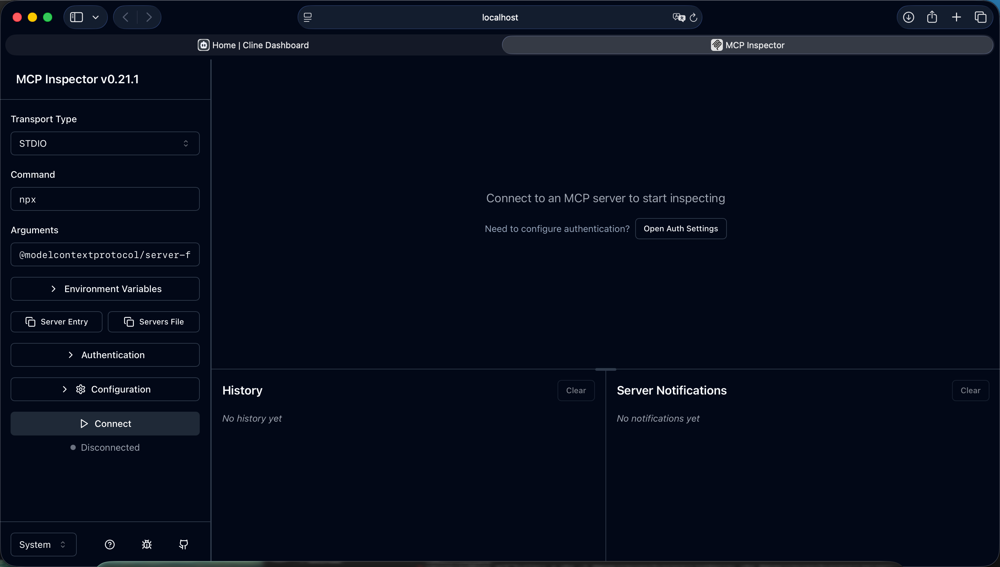
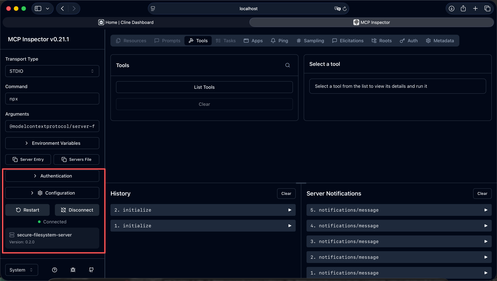
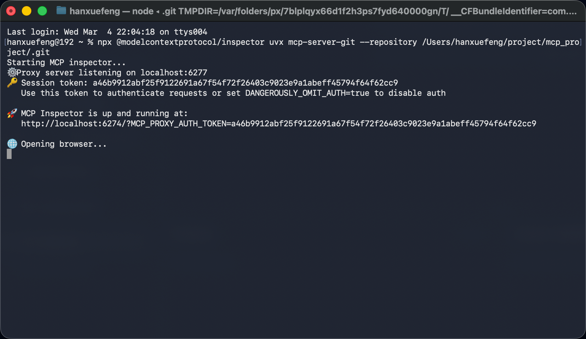
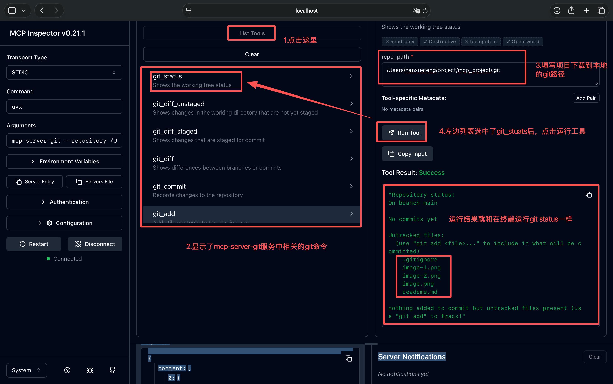
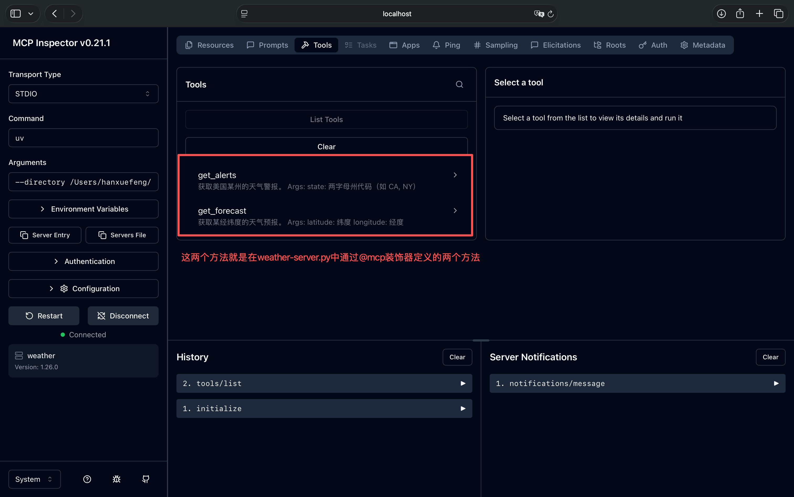

# MCP 调试工具
- MCP Inspector 是一个用于测试和调试 MCP 服务器的图形化工具


# mcp inspector调试工具启动
- Inspector 通过 npx 运行，无需单独安装：
```
npx @modelcontextprotocol/inspector <command>
```
<command> 是启动 MCP 服务器的方式，Inspector 会接管该进程并与服务器通信。

# 连接不同类型的服务器
服务器来源	命令格式	示例
npm 包	npx -y @modelcontextprotocol/inspector npx <包名> <参数>	见下方
PyPI 包	npx @modelcontextprotocol/inspector uvx <包名> <参数>	见下方
本地项目	npx @modelcontextprotocol/inspector uv --directory <路径> run <包名> <参数>	见下方

示例 1：连接 npm 文件系统服务器
npx -y @modelcontextprotocol/inspector npx @modelcontextprotocol/server-filesystem /Users/hanxuefeng/Desktop

- @modelcontextprotocol/inspector  是启动mcp客户端的命令
http://localhost:6274/?MCP_PROXY_AUTH_TOKEN=2d672df318c7b57151b4518924bfc86e5dc0785c41ac940d5cb0879866d83144


- @modelcontextprotocol/server-filesystem 是表示提供文件服务的mcp服务器

- 连接服务器后的界面


npx -y：自动确认安装，不交互
@modelcontextprotocol/server-filesystem：npm 包名
/Users/hanxuefeng/Desktop：传给服务器的参数（要访问的目录）


# 示例 2：连接 PyPI Git 服务器
- 在终端运行如下命令
```
hanxuefeng@192 ~ % npx @modelcontextprotocol/inspector uvx mcp-server-git --repository /Users/hanxuefeng/project/mcp_project/.git
Starting MCP inspector...
⚙️ Proxy server listening on localhost:6277
🔑 Session token: a46b9912abf25f9122691a67f54f72f26403c9023e9a1abeff45794f64f62cc9
   Use this token to authenticate requests or set DANGEROUSLY_OMIT_AUTH=true to disable auth

🚀 MCP Inspector is up and running at:
   http://localhost:6274/?MCP_PROXY_AUTH_TOKEN=a46b9912abf25f9122691a67f54f72f26403c9023e9a1abeff45794f64f62cc9

🌐 Opening browser...
```

npx @modelcontextprotocol/inspector uvx mcp-server-git --repository /Users/hanxuefeng/project/mcp_project/.git






uvx：用 uv 运行 PyPI 包（类似 npx 之于 npm）
mcp-server-git：PyPI 包名
--repository：传给服务器的参数


# 示例 3：连接本地开发的服务器
- 在/Users/hanxuefeng/project/mcp_project/weather-server.py 开发了一个天气 MCP 服务器：
- 在终端运行下面的命令
npx @modelcontextprotocol/inspector uv --directory /Users/hanxuefeng/project/mcp_project run weather-server.py

```
hanxuefeng@192 ~ % npx @modelcontextprotocol/inspector uv --directory /Users/hanxuefeng/project/mcp_project run weather-server.py
Starting MCP inspector...
⚙️ Proxy server listening on localhost:6277
🔑 Session token: 6aaff6932a18cfbd7fc3f5724b6cd4cf6192be9c830e2cc59660558bcd3f3293
   Use this token to authenticate requests or set DANGEROUSLY_OMIT_AUTH=true to disable auth

🚀 MCP Inspector is up and running at:
   http://localhost:6274/?MCP_PROXY_AUTH_TOKEN=6aaff6932a18cfbd7fc3f5724b6cd4cf6192be9c830e2cc59660558bcd3f3293

🌐 Opening browser...
```



--directory：项目根目录
run：uv 子命令
weather-server：包名（来自 pyproject.toml 的 [project].name）


#### 流程
1. 打开主机，比如vscoe，cline
2. 在主机内，通过@modelcontextprotocol/inspector  启动mcp客户端  @modelcontextprotocol/server-filesystem
3. mcp客户端去连接 mcp服务 mcp-weather.py


# mcp加载资源
npx @modelcontextprotocol/inspector uv --directory /Users/hanxuefeng/project/mcp_project run resources_server.py


# 使用ai插件cline,cherry-ai 插件连接mcp远程服务器注意点
- 如果mcp是居于streamHttp创建的http服务，那要一直启动，要不然ai工具没法连接上
- 如果mcp服务是居于stido创建的，表示是本地的服务，没有网络开销


主机通过客户端加载 启动客户端内部自己起服务 然后客服端调工具 顺序是这样吗 老师

1. 先打开主机，比如打开vscode 、cherry study 、cline
2. 在主机内启动MCP客户端
3. MCP客户端会去连接自己的MCP服务器
   - 如果是stdio传输的，需要让MCP客户端这个主进程内部通过子进程启动自己的MCP服务器，再用自己这个客户端连接自己启动的MCP服务器
   - 如果是http传输的，不会自己通过子进程启动服务器了，而是直接连接配置的url服务器


npx @modelcontextprotocol/inspector uv --directory D:/forever/rag_code/12.mcp run completions_server.py


npx @modelcontextprotocol/inspector uv --directory /Users/hanxuefeng/project/mcp_project run get-china-weather-server.py


npx @modelcontextprotocol/inspector uv --directory /Users/hanxuefeng/project/mcp_project run tool_server.py client